# Telefone
Este repositório representa meu projeto privado (*ao qual não irei expôr o código-fonte para evitar que outras pessoas o clonem e usem-o sem minha autorização*) que tem como objetivo criar um Telefone que pode ser customizado dinamicamente utilizando as tecnologias: HTML, JavaScript, NodeJS, SASS, dentre outras.

## Detalhes técnicos:
• Frontend em HTML, SASS e JavaScript com foco em experiência do usuário  
• Backend em Lua com comunicação client-server baseada em eventos  
• Implementação de sistema de contatos, chamadas, mensagens, notificações e mais  
• Integração com banco de dados para persistência de dados  
• Sincronização em tempo real entre usuários

### Navegue abaixo pelas páginas e seções do telefone que eu construí:

## Aplicativos
### Telas de aplicativos criados por mim.
#### Exemplos:
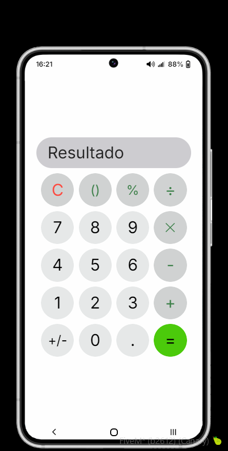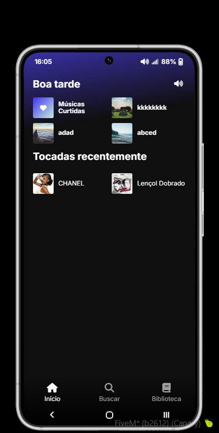
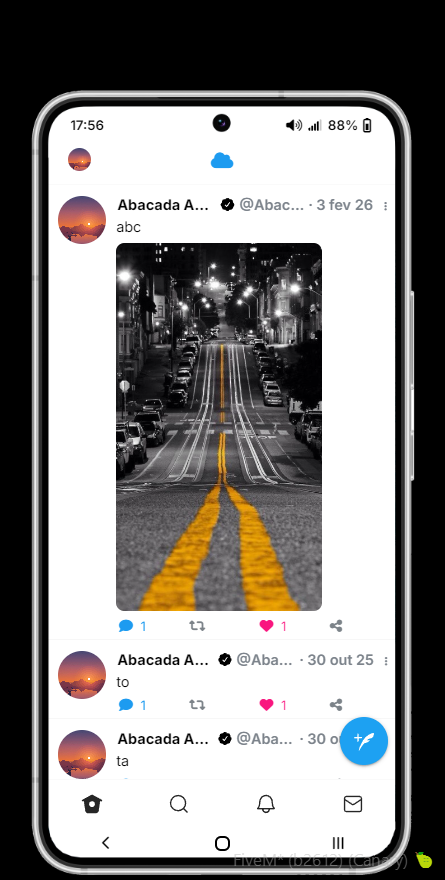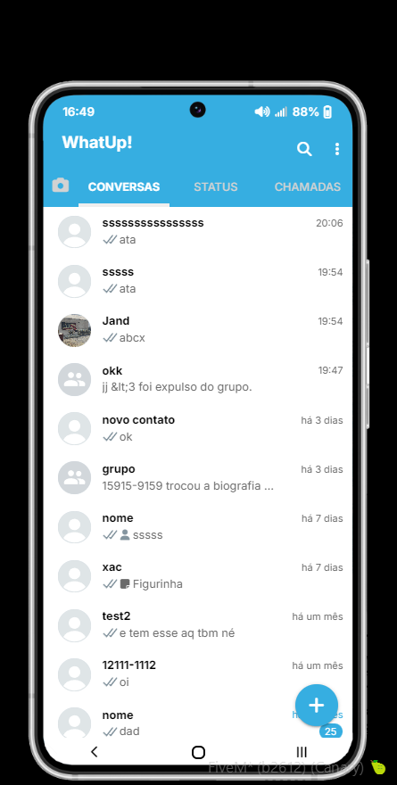

<a href="./apps/README.md">Ver mais</a>

## Android
### Telas e elementos criados por mim inspirados no visual Android.
#### Exemplos:
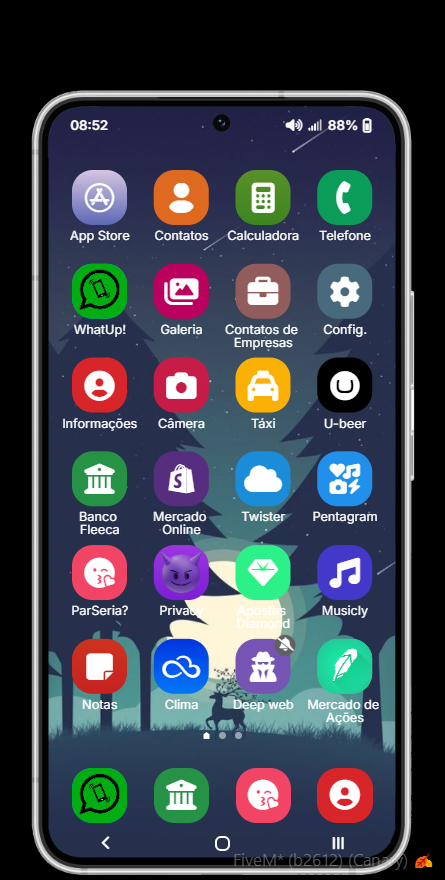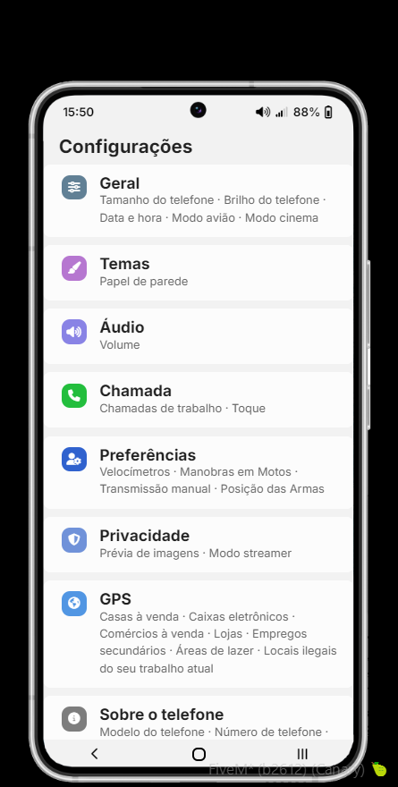
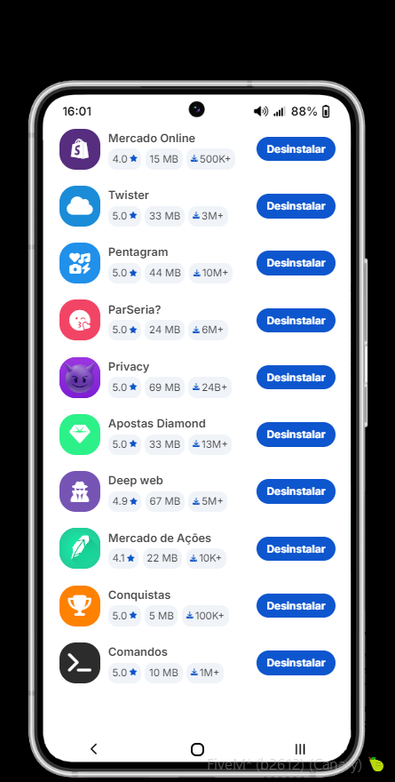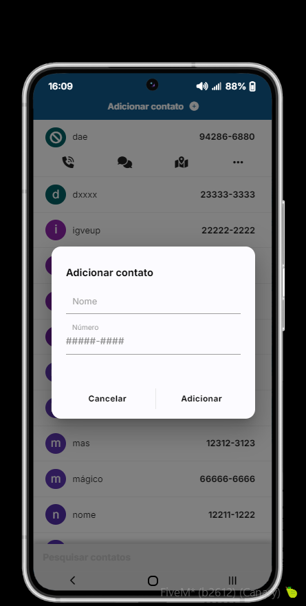

<a href="./android/README.md">Ver mais</a>

## iOS
### Telas e elementos criados por mim inspirados no visual iOS.
#### Exemplos:
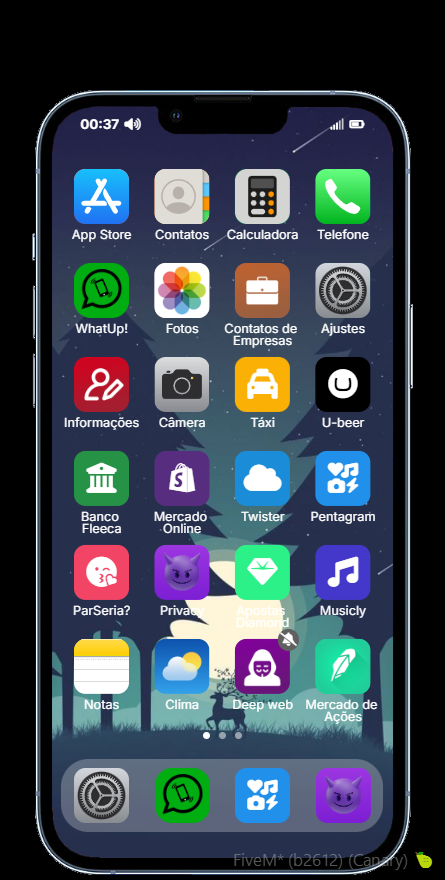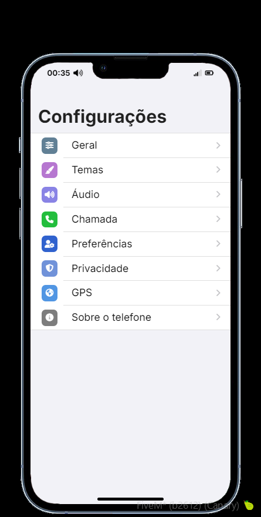
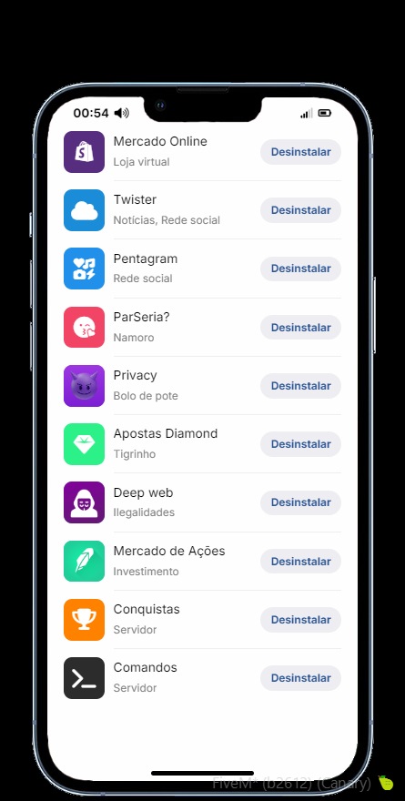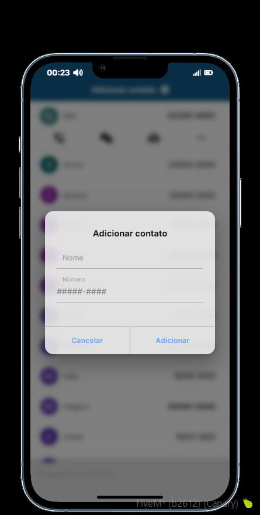

<a href="./ios/README.md">Ver mais</a>

## Windows Phone
### Telas e elementos criados por mim inspirados no visual Windows Phone.
#### Exemplos:
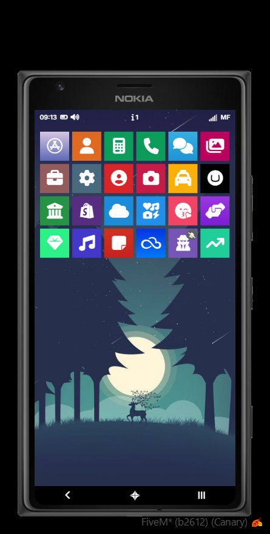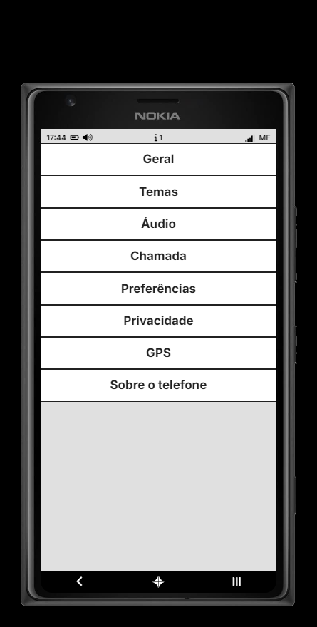
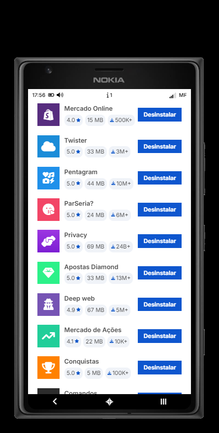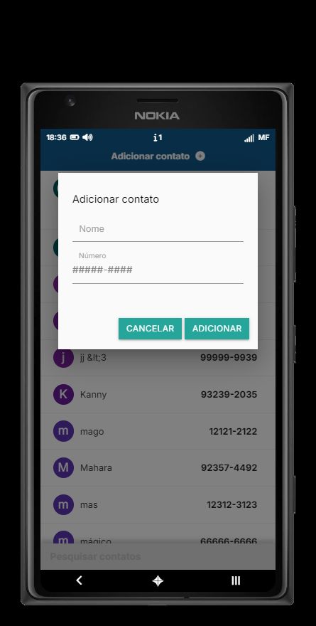

<a href="./windowsphone/README.md">Ver mais</a>
