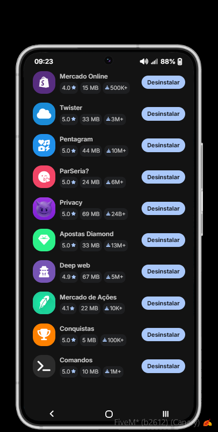
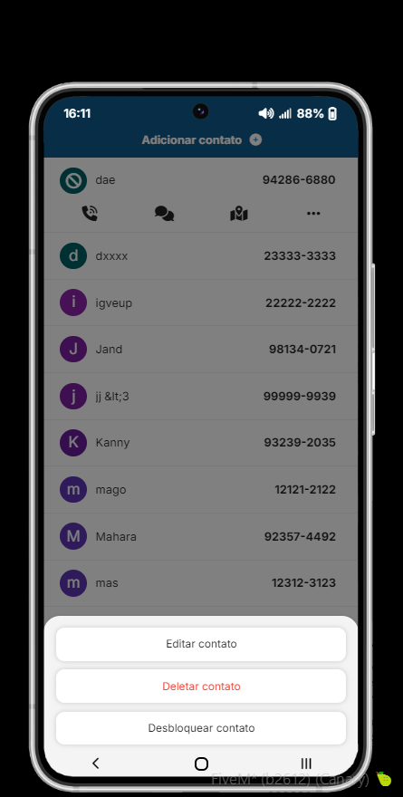
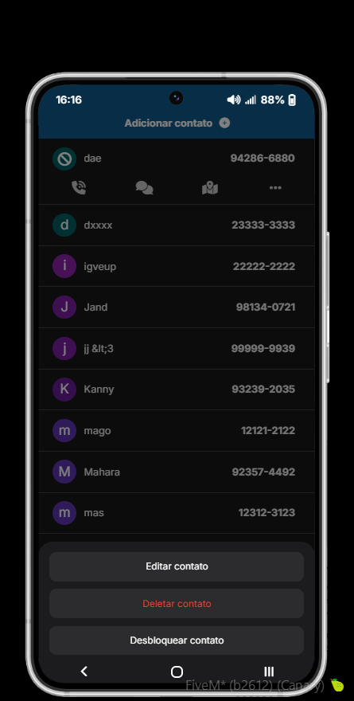
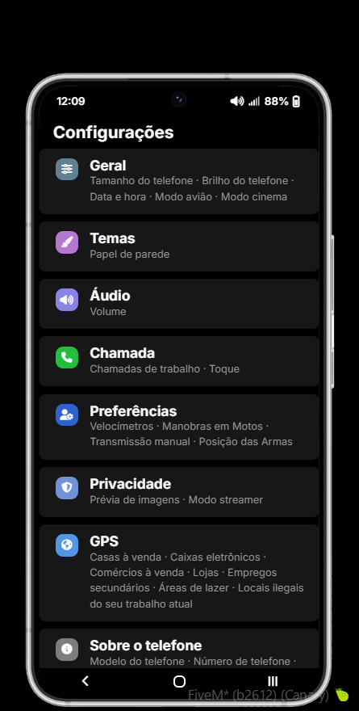
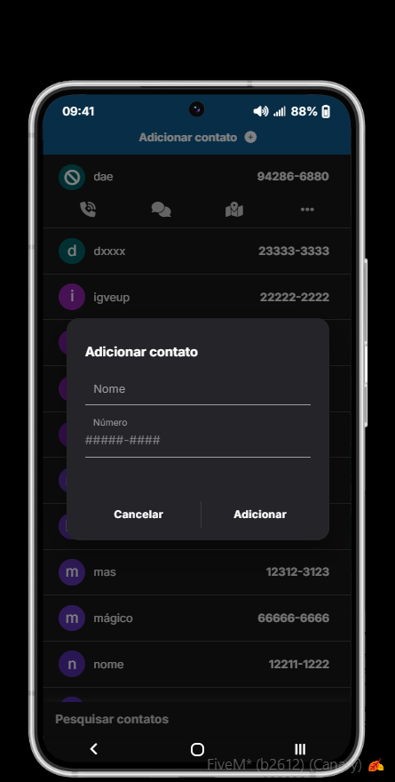
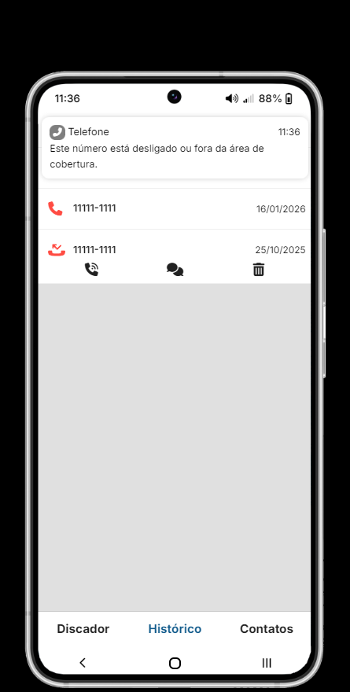
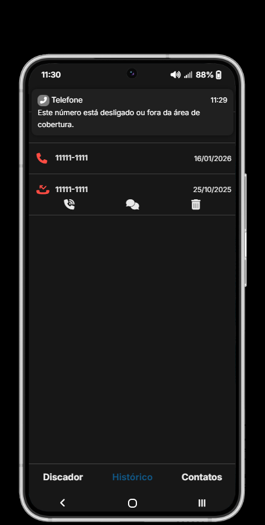

# Android Phone

## App Store
#### Aplicativo que permite o usuário instalar/desinstalar outros aplicativos especificados no arquivo de configurações do script.

## Caixa de diálogo
#### Exemplo do visual da Caixa de diálogo que foi escolhida por mim para telefones que iriam utilizar o modelo **Android**.

## Configurações
#### Visual do aplicativo **Configurações** que foi escolhida por mim para telefones que iriam utilizar o modelo **Android**.

## Modal
#### Exemplo do visual dos Modals que foi escolhida por mim para telefones que iriam utilizar o modelo **Android**.

## Notificação
#### Exemplo do visual das Notificações que foi escolhida por mim para telefones que iriam utilizar o modelo **Android**.

## Tela inicial
#### Visual da tela inicial que foi escolhida por mim para telefones que iriam utilizar o modelo **Android**.

