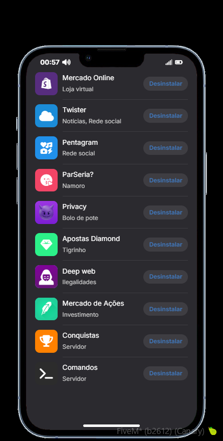
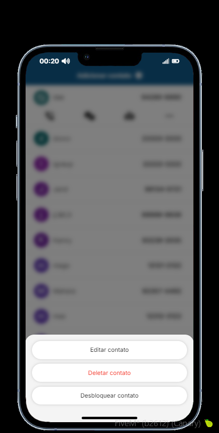
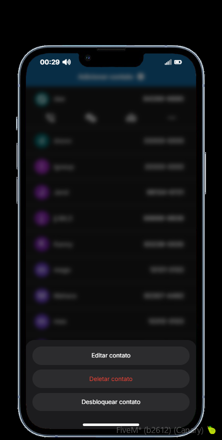
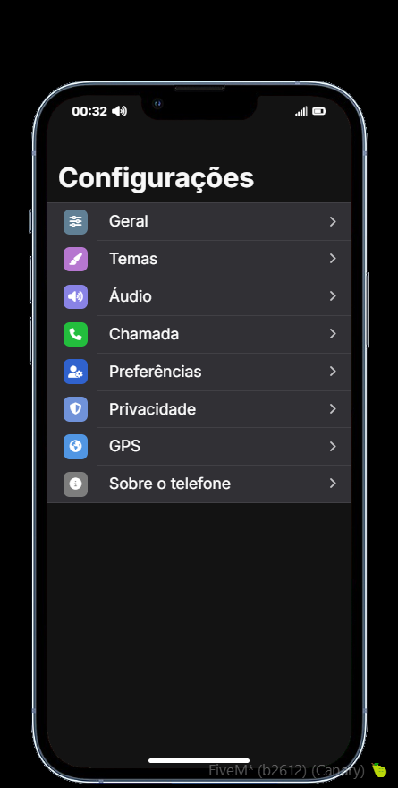
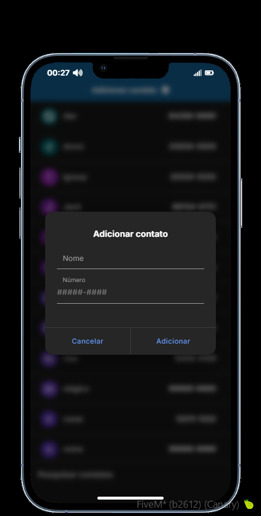
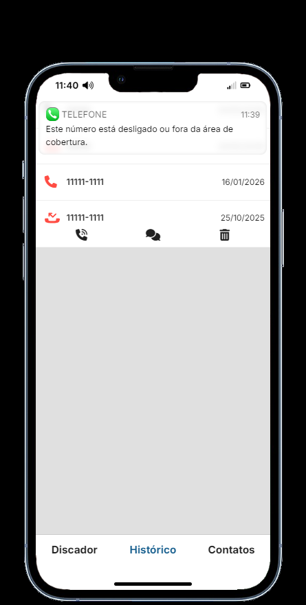
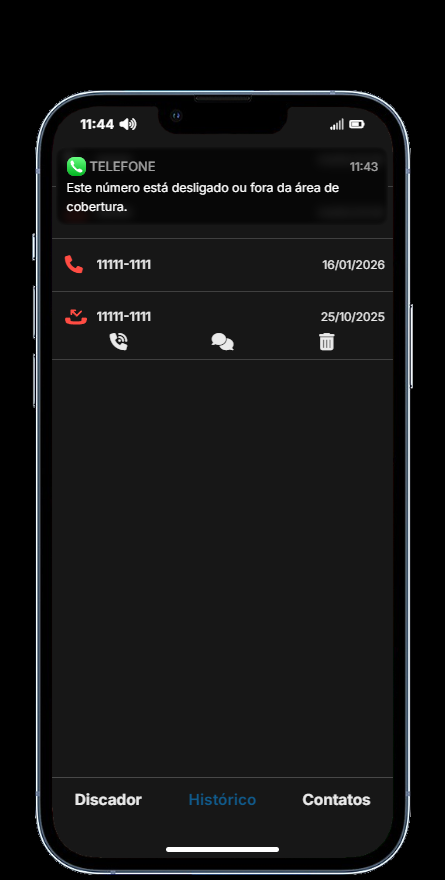

# iPhone

## App Store
#### Aplicativo que permite o usuário instalar/desinstalar outros aplicativos especificados no arquivo de configurações do script.

## Caixa de diálogo
#### Exemplo do visual da Caixa de diálogo que foi escolhido por mim para telefones que iriam utilizar o modelo **iPhone**.

## Configurações
#### Visual do aplicativo **Configurações** que foi escolhido por mim para telefones que iriam utilizar o modelo **iPhone**.

## Modal
#### Exemplo do visual dos Modals que foi escolhido por mim para telefones que iriam utilizar o modelo **iPhone**.

## Notificação
#### Exemplo do visual das Notificações que foi escolhido por mim para telefones que iriam utilizar o modelo **iPhone**.

## Tela inicial
#### Visual da tela inicial que foi escolhido por mim para telefones que iriam utilizar o modelo **iPhone**.

